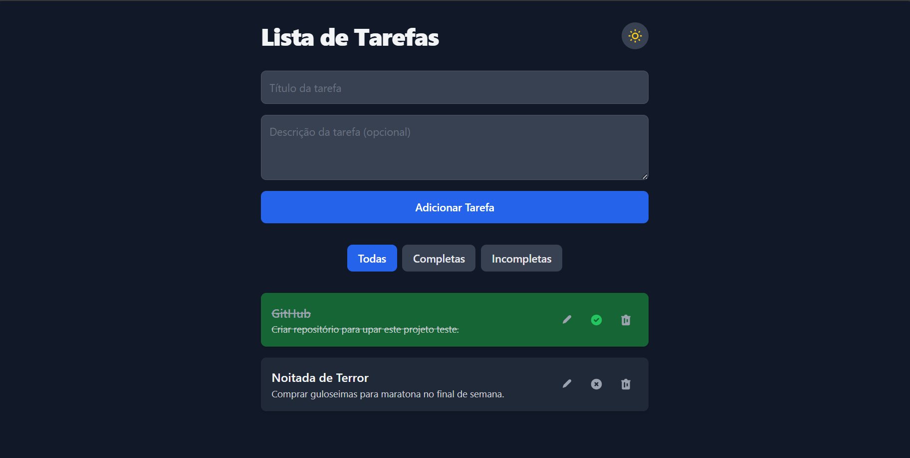

# 📋 Todo-List App
Uma aplicação web moderna para gerenciamento de tarefas, desenvolvida com **Next.js** e **React**.

## 📸 Captura de Tela


---

## ✨ Funcionalidades
- **Adicionar Tarefa**: Crie novas tarefas com título e descrição.
- **Editar Tarefa**: Modifique o título e a descrição de tarefas existentes.
- **Excluir Tarefa**: Remova tarefas que não são mais necessárias.
- **Marcar como Concluída**: Alterne o status de uma tarefa.
- **Filtrar Tarefas**: Visualize todas as tarefas, apenas as concluídas ou apenas as incompletas.
- **Modo Escuro**: Alterne o tema da interface para o modo claro ou escuro.
- **Persistência de Dados**: As tarefas e a configuração de tema são salvas no `localStorage`, persistindo entre sessões.

---

## 🧩 Decisões Técnicas
- Utilização do **Next.js (App Router)** para aproveitar renderização híbrida (SSR/SSG) e organização moderna de rotas.
- **LocalStorage** foi escolhido pela simplicidade de persistência local sem necessidade de backend.
- **Tailwind CSS** adotado pela agilidade no desenvolvimento e facilidade para implementar responsividade e dark mode.
- Separação de componentes para garantir reuso e manutenibilidade do código.

---

## 🛠 Tecnologias Utilizadas
- [Next.js (App Router)](https://nextjs.org/) → Estrutura da aplicação e otimizações de renderização.
- [React](https://react.dev/) → Biblioteca para construção da interface de usuário.
- [TypeScript](https://www.typescriptlang.org/) → Tipagem estática para evitar erros de tempo de execução.
- [Tailwind CSS](https://tailwindcss.com/) → Framework CSS _utility-first_ para estilização rápida e responsiva.

---

## 🚀 Como Rodar o Projeto Localmente
### 🔍 Pré-requisitos
Certifique-se de ter o **Node.js** e o **npm** instalados.

1. Abra o terminal (ou Prompt de Comando, no Windows).
Digite o seguinte comando e pressione Enter para verificar a versão do Node.js:
```bash
node -v
```
> A resposta deve ser a versão instalada, por exemplo: v18.17.0.

2. Em seguida, digite este comando para verificar a versão do npm:
```bash
npm -v
```
> A resposta deve ser a versão instalada, por exemplo: 9.6.7.

### 📥 Instalação
1. Clone o repositório para sua máquina local:
```bash
git clone [URL_DO_SEU_REPOSITORIO]
cd nome-do-seu-projeto
```

2. Instale as dependências
```bash
npm install
```

### Execução
1. Inicie o servidor de desenvolvimento:
```bash
npm run dev
```
2. Abra seu navegador e navegue para http://localhost:3000 para ver a aplicação em funcionamento.
